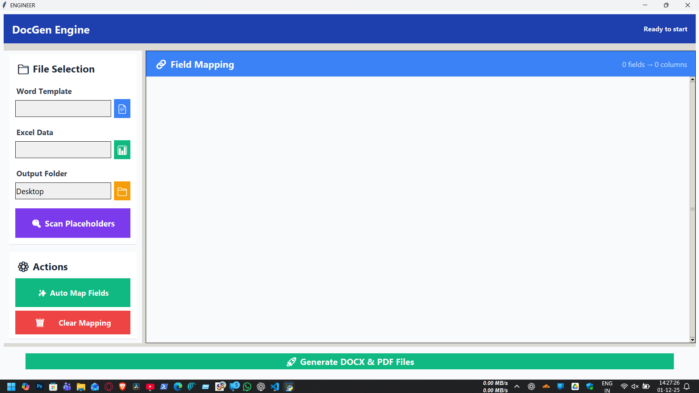

# DocGen Engine

DocGen Engine is a professional desktop application for automated document generation from Excel data and Word templates. Built with Python, Tkinter, DocxTemplate, and pandas, it produces personalized DOCX and PDF files through a modern, glass-morphism styled GUI.



<iframe width="964" height="542" src="https://www.youtube.com/embed/iBagwUeEIn0" title="Automate Certificate &amp; Document Generation with Python | DocGen Engine Full Demo" frameborder="0" allow="accelerometer; autoplay; clipboard-write; encrypted-media; gyroscope; picture-in-picture; web-share" referrerpolicy="strict-origin-when-cross-origin" allowfullscreen></iframe>

[Watch the tutorial on YouTube](https://youtu.be/iBagwUeEIn0?si=myVqZyUXeW0SIBCi)

## 🚀 Features

- **Template-based document generation** using `.docx` placeholders
- **Excel data integration** with `.xlsx` and `.xls` support
- **Smart auto-mapping** between template fields and Excel columns
- **DOCX + PDF output** (Microsoft Word required for PDF conversion)
- **Batch processing** for high-volume runs
- **Custom file naming** with mobile numbers or any column value
- **Live preview** of mapped fields prior to generation
- **Integrated logging** for troubleshooting

## 📋 System Requirements

- Windows 10 or Windows 11
- Microsoft Word installed (for PDF export)
- Python 3.8+ (required only for Methods 2 and 3)

## 🔧 Installation & Usage Guide

Choose the approach that best matches your workflow:

1. **Method 1 – Download EXE & Run (Recommended for non-developers)**
2. **Method 2 – Clone repo & run `launcher.py` (minimal Python setup)**
3. **Method 3 – Clone repo & build your own EXE with PyInstaller**

### Method 1 – Download the EXE & Run

This is the simplest path and does **not** require Python.

1. **Download the executable**
	- Go to the GitHub Releases page.
	- Download `DocGen Engine.exe` or `DocGen-Engine.zip`.
2. **Extract the ZIP** (if applicable)
	```text
	Right-click → Extract All
	```
3. **Run the app**
	```text
	Double-click DocGen Engine.exe
	```
4. **Install missing dependencies if prompted**
	```bash
	pip install pandas docxtpl python-docx pywin32 tkinter
	```
	Rerun the executable after installation.

### Method 2 – Clone Repository & Run the Python Source

Great for developers who want to inspect or extend the code.

1. **Clone the repository**
	```bash
	git clone https://github.com/vjaykr/DocGen-Engine.git
	cd DocGen-Engine
	```
2. **(Optional) Create and activate a virtual environment**
	```bash
	python -m venv .venv
	.venv\Scripts\activate
	```
3. **Install dependencies**
	```bash
	pip install -r requirements.txt
	```
	Or manually:
	```bash
	pip install pandas docxtpl python-docx pywin32 tkinter
	```
4. **Run the application**
	```bash
	python launcher.py
	```
	Keep the terminal open to monitor logs and errors.

### Method 3 – Build Your Own EXE (Packaging/Deployment)

Use this when you need to distribute a custom executable.

1. **Clone the repository**
	```bash
	git clone https://github.com/vjaykr/DocGen-Engine.git
	cd DocGen-Engine
	```
2. **Install build dependencies**
	```bash
	pip install -r requirements.txt
	pip install pyinstaller
	```
3. **Build the executable**
	- Preferred: run the helper script
	  ```bash
	  exe_build.bat
	  ```
	- Manual alternative:
	  ```bash
	  pyinstaller --onefile --noconsole --name "DocGen Engine" launcher.py
	  ```
4. **Locate the output**
	```text
	dist/DocGen Engine.exe
	```
5. **Distribute/run**
	- Zip the entire `dist/` folder before sharing.
	- Double-click the EXE to run; dependencies are validated on launch.

## 📖 Using DocGen Engine

### 1. Prepare Your Word Template

Use double curly braces for placeholders:

```
Dear {{name}},
Your order {{order_id}} is confirmed.
```

### 2. Prepare Your Excel Data

- Include clear column headers (e.g., `name`, `order_id`, `mobile`).
- Each row represents one document to be generated.

### 3. Run the Application

1. Launch via your chosen method:
	- Method 1: double-click `DocGen Engine.exe`.
	- Method 2: run `python launcher.py`.
	- Method 3: double-click the EXE you built.
2. Select your Word template, Excel data file, and (optionally) an output folder.
3. Click **🔍 Scan Placeholders**.
4. Review/adjust field mappings (auto-mapping handles most cases).
5. Click **👁️ Preview Data** to verify records.
6. Click **🚀 Generate DOCX & PDF Files**.

### 4. Access the Output

- `SaralWorks_DOCX/` – generated Word files
- `SaralWorks_PDF/` – generated PDF files

## 💡 Example

**Template (`contract.docx`)**

```
EMPLOYMENT CONTRACT

Employee Name: {{employee_name}}
Position: {{position}}
Salary: ${{salary}}
Start Date: {{start_date}}
Department: {{department}}
```

**Excel (`employees.xlsx`)**

| employee_name | position  | salary | start_date | department |
|---------------|-----------|--------|------------|------------|
| John Smith    | Developer | 75000  | 2024-01-15 | IT         |
| Jane Doe      | Designer  | 65000  | 2024-02-01 | Marketing  |

**Result**

- 2 DOCX files with personalized contracts
- 2 PDF files ready for distribution

## ⚙️ Advanced Features

- **AI-like auto-mapping**: exact, variation, and partial matching
- **Flexible file naming**: use any column or include mobile numbers automatically
- **Robust error handling**: dependency checks, template validation, and live logs

## 🛠️ Tech Stack

- Python 3.12
- Tkinter
- pandas
- docxtpl / python-docx
- pywin32
- PyInstaller

## 📚 Project Architecture

```
DocGen-Engine/
├── launcher.py        # App entry point + dependency checks
├── ui/                # Tkinter GUI components
├── engine/            # Core template engine & document logic
├── utils/             # Helper modules
├── requirements.txt
└── exe_build.bat      # EXE build script
```

## 🤝 Contributing

1. Fork the repository.
2. Create a feature branch: `git checkout -b feature/MyFeature`.
3. Commit your changes and push.
4. Open a Pull Request.

## 📝 License

Distributed under the MIT License. See `LICENSE` for details.

## 🐛 Issues & Support

- Report bugs via the **Issues** tab.
- Request features in the same place.
- Additional documentation lives in the Wiki.

## 📊 Changelog

### v1.0.0

- Initial release
- Template-based document automation
- Excel data integration
- Auto-field mapping
- PDF conversion
- Modern UI

---

**Made with ❤️ for document automation.**

Need extras (logo, wiki, PDF guide, installer)? Open an issue and I’ll help!